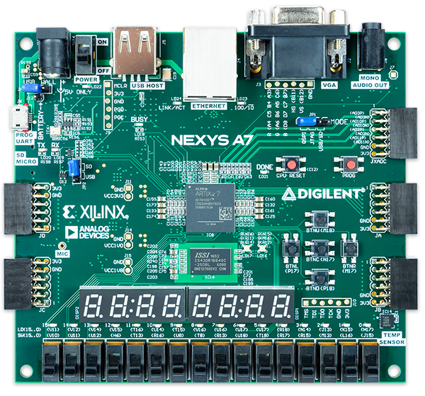
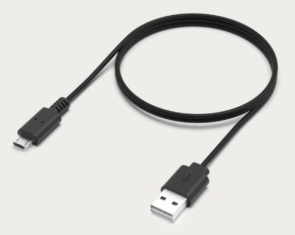
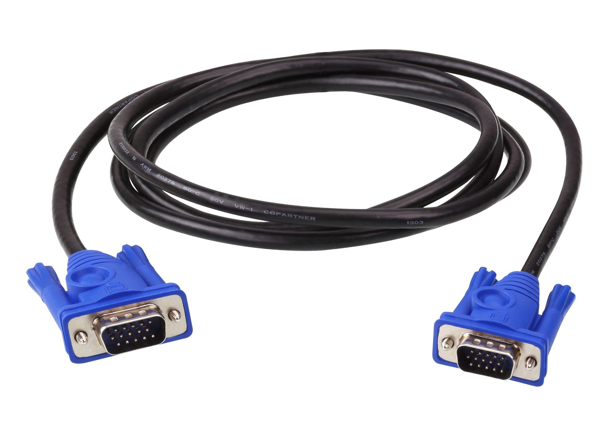
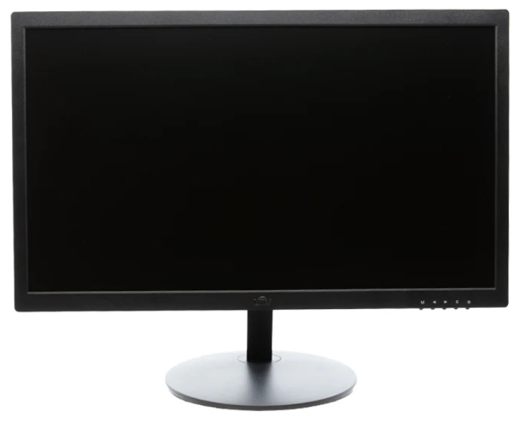

# CPE 487 Final Project - Grid Escape
**By: Atharva Shaligram and Sean Anderson**

A 2D platformer game designed in VHDL and displayed on a screen using an FPGA board and VGA connector

## Project Overview

The goal of this project was to create a 2D platformer game using a Nexys A7 board and VGA display. The project replicated common game mechanics from platformer games such as movement, collision detection, and attacking.

### Gameplay Win

### Gameplay Lose

### Main Aspects of Grid Escape:

#### Map Creation:

- The start of the game generates and displays the map, player, and enemies (purple ghosts) on the screen.

- Brick wall boundaries are created with staircases, mushrooms, and a flag at the end.

#### Player Movement:

- Four buttons are the inputs for the player movement, which are BTNL to move left, BTNR to move right, BTNU to jump, and BTNC to attack.

- Gravity is always factored in for the player, so player can fall off platforms if there are open areas.

#### Collision Detection:

- Collision detection dictates player movement.

## Expected Behavior

- When the game loads in, a map and player is generated and displayed on the screen.

  - Brick wall boundaries are created, with staircases, mushrooms, and a flag at end.

  - Purple ghosts are hovering over platforms.

- Player moves around the map

## Required Hardware
For the game to work, you will need the following:
- Nexys A7-100T FPGA Board
  
  
  
- Micro USB cable
  
  
  
- VGA Cable
  
  
  
- Monitor with VGA Port
  
  
  
- AMD Vivado™ Design Suite

## Setup
Download the following files from the repository to your computer:

Once you have downloaded the files, follow these steps:
1. Open **AMD Vivado™ Design Suite** and create a new RTL project called _Grid Escape_ in Vivado Quick Start
2. In the "Add Sources" section, click on "Add Files" and add all of the `.vhd` files from this repository
3. In the "Add Constraints" section, click on "Add Files" and add the `.xdc` file from this repository
4. In the "Default Part" section, click on "Boards" and find and choose the Neyxs A7-100T board
5. Click "Finish" in the New Project Summary page
6. Run Synthesis
7. Run Implementation
8. Generate Bitstream
9. Connect the Nexys A7-100T board to the computer using the Micro USB cable and switch the power ON
10. Connect the VGA cable from the Nexys A7-100T board to the VGA monitor
11. Open Hardware Manager
     - "Open Target"
     - "Auto Connect"
     - "Program Device"
12. Program should appear on the screen

## Module Hierarchy


## Inputs and Outputs

### `Game_Main.vhd`
```
ENTITY Game_Main IS
    PORT (
        clk_in : IN STD_LOGIC; -- system clock
        VGA_red : OUT STD_LOGIC_VECTOR (3 DOWNTO 0); -- VGA outputs
        VGA_green : OUT STD_LOGIC_VECTOR (3 DOWNTO 0);
        VGA_blue : OUT STD_LOGIC_VECTOR (3 DOWNTO 0);
        VGA_hsync : OUT STD_LOGIC;
        VGA_vsync : OUT STD_LOGIC;
        btnl : IN STD_LOGIC;
        btnr : IN STD_LOGIC;
        btnc : IN STD_LOGIC;
        btnd : IN STD_LOGIC;
        btnu : IN STD_LOGIC;
        SEG7_anode : OUT STD_LOGIC_VECTOR (7 DOWNTO 0); -- anodes of four 7-seg displays
        SEG7_seg : OUT STD_LOGIC_VECTOR (6 DOWNTO 0)
    ); 
END Game_Main;
```

#### Inputs
 - clk_in: System clock
 - btnl: Left Button, used to move left
 - btnr: Right Button, used to move right
 - btnc: Center Button, used to attack/unalive enemies
 - btnd: Down Button, used to reset the game
 - btnu: Up Button, used to jump
#### Outputs
 - VGA_red: Controls red output to VGA screen
 - VGA_green: Controls green output to VGA screen
 - VGA_blue: Controls blue output to VGA screen
 - VGA_hsync: Horizontal sync signal for VGA display
 - VGA_vsync: Vertical sync signal for VGA display
 - SEG7_anode: Controls the anodes of the 7-segment display
 - SEG7_seg: Controls the segments of the 7-segment display

### `tilemap_vga.vhd`
```
ENTITY tilemap_vga IS
    PORT (
        clk         : IN  STD_LOGIC;
        pixel_row   : IN  STD_LOGIC_VECTOR(10 DOWNTO 0);
        pixel_col   : IN  STD_LOGIC_VECTOR(10 DOWNTO 0);
        btnl        : IN STD_LOGIC;
        btnr        : IN STD_LOGIC;
        btnu        : IN STD_LOGIC;
        btnd        : IN STD_LOGIC;
        btnc        : IN STD_LOGIC;
        red         : OUT STD_LOGIC;
        green       : OUT STD_LOGIC;
        blue        : OUT STD_LOGIC;
        counter     : OUT STD_LOGIC_VECTOR(15 DOWNTO 0);
        new_last_score : OUT STD_LOGIC_VECTOR(15 DOWNTO 0)
    );
END tilemap_vga;
```

#### Inputs
 - clk: System clock
 - pixel_row: 
 - pixel_col:
 - btnl: Left Button, used to move left
 - btnr: Right Button, used to move right
 - btnc: Center Button, used to attack/unalive enemies
 - btnd: Down Button, used to reset the game
 - btnu: Up Button, used to jump
#### Outputs
 - red: Controls red output
 - green: Controls green output
 - blue: Controls blue output
 - counter: Used for counting game time
 - new_last_score: Used to update current saved game completion time to previous game completion time

## Modifications

### Game_Main.vhd (previously pong.vhd) Modified
The top level file of our project was based off of pong.vhd from Lab 6. We added more ports in to include all of the directional buttons on the FPGA board which include BTNL, BTNR, BTNC, BTNU, BTND. We added one new componenet which was tilemap_vga that includes most of the game logic. The port mapping of leddec16 was modified slightly to include two separate display ports where one would display the current game time and the other would display the previous game time. A process was added to allow for constant update of the leds. Tilemap_vga port mapping includes clock, pixel row, pixel column and all of the button as in ports and red, green, blue, counter for time, and new_last_score (previous game completion time) as out ports.

### leddec16.vhd
This file was only modified slightly to take in two data in ports. One of them would be the current game time displayed on the right four leds and the other would be the previous game completion time displayed on the left four leds. 
```
ENTITY leddec16 IS
	PORT (
		dig : IN STD_LOGIC_VECTOR (2 DOWNTO 0); -- which digit to currently display
		data_1 : IN STD_LOGIC_VECTOR (15 DOWNTO 0); -- 16-bit (4-digit) data
		data_2 : IN STD_LOGIC_VECTOR (15 DOWNTO 0);
		anode : OUT STD_LOGIC_VECTOR (7 DOWNTO 0); -- which anode to turn on
		seg : OUT STD_LOGIC_VECTOR (6 DOWNTO 0)); -- segment code for current digit
END leddec16;

ARCHITECTURE Behavioral OF leddec16 IS
	SIGNAL data4 : STD_LOGIC_VECTOR (3 DOWNTO 0); -- binary value of current digit
BEGIN
	-- Select digit data to be displayed in this mpx period
	data4 <= data_1(3 DOWNTO 0) WHEN dig = "000" ELSE -- digit 0
	         data_1(7 DOWNTO 4) WHEN dig = "001" ELSE -- digit 1
	         data_1(11 DOWNTO 8) WHEN dig = "010" ELSE -- digit 2
	         data_1(15 DOWNTO 12) WHEN dig = "011" ELSE -- digit 3
	         data_2(3 DOWNTO 0) WHEN dig = "100" ELSE -- digit 0
	         data_2(7 DOWNTO 4) WHEN dig = "101" ELSE -- digit 1
	         data_2(11 DOWNTO 8) WHEN dig = "110" ELSE -- digit 2
	         data_2(15 DOWNTO 12); -- digit 3
```

### Game_Main.xdc (previously pong.xdc) Modified
This xdc file was modified to include all of the buttons packages. 
```
set_property -dict { PACKAGE_PIN N17 IOSTANDARD LVCMOS33 } [get_ports { btnc }]; #IO_L9P_T1_DQS_14 Sch=btnc
set_property -dict { PACKAGE_PIN P17 IOSTANDARD LVCMOS33 } [get_ports { btnl }]; #IO_L12P_T1_MRCC_14 Sch=btnl
set_property -dict { PACKAGE_PIN M17 IOSTANDARD LVCMOS33 } [get_ports { btnr }]; #IO_L10N_T1_D15_14 Sch=btnr
set_property -dict { PACKAGE_PIN P18 IOSTANDARD LVCMOS33 } [get_ports { btnd }]; #IO_L9N_T1_DQS_D13_14 Sch=btnd
set_property -dict { PACKAGE_PIN M18 IOSTANDARD LVCMOS33 } [get_ports { btnu }]; #IO_L4N_T0_D05_14 Sch=btnu
```

## Conclusion

### Responsibilities

### Timeline of Work Completed

### Difficulties 

